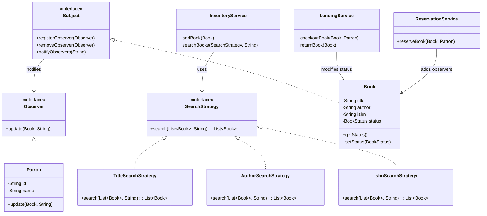

# Library Management System

A Java-based console application demonstrating Object-Oriented Programming (OOP) concepts, SOLID principles, and design patterns.

## Features

- **Book Management**: Add and remove books. Search functionalities by Title, Author, and ISBN using the **Strategy Pattern**.
- **Patron Management**: Add new patrons, update information, and track borrowing history.
- **Lending Process**: Handled through a dedicated `LendingService` which encapsulates book checkout and return flows.
- **Inventory Management**: Track and manage available/borrowed/reserved book statuses dynamically.
- **Reservation System (Optional Extension)**: If a book is checked out, other patrons can reserve it. Once returned, reserving patrons are notified automatically leveraging the **Observer Pattern**.
- **Recommendation System (Optional Extension)**: Suggests books based on the authors a patron has previously borrowed.

## Design Patterns Used

1. **Strategy Pattern**: Encapsulates search algorithms (`SearchByTitle`, `SearchByAuthor`, `SearchByIsbn`). Easily extendable if new search metrics emerge without modifying the `InventoryService`.
2. **Observer Pattern**: Facilitates real-time notifications for reservations. Books act as `Subject`s; Patrons act as `Observer`s. When a book's status reverts to `AVAILABLE`, Patrons in the reservation list receive a notification.
3. **Factory Pattern**: Centralizes instantiation of domain objects like Books and Patrons (`LibraryFactory`) to maintain low coupling.

## System Architecture & SOLID Principles

The project adheres strictly to **SOLID** principles:
- **S** - Single Responsibility Principle enforced by separating layers: Models, Services (Lending, Inventory, Reservation), Observers, and Search Strategies.
- **O** - Open/Closed Principle applied in Search Strategies: new search algorithms can be plugged in easily.
- **D** - Dependency Inversion applied via `SearchStrategy`, `Observer`, and `Subject` abstractions.

### Class Diagram



## Running the Application

You can compile and run the application using normal `javac` and `java` commands from the console.

```bash
cd src
javac com/library/**/*.java com/library/*.java
java com.library.Main
```
